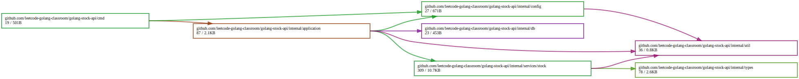
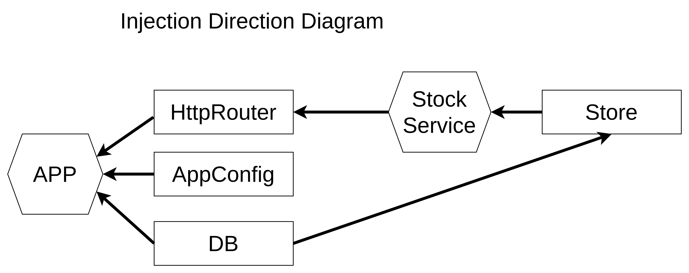

# golang-stock-api

This repository is implementation of stock tracker by golang


## setup stock db

```shell
CREATE DATABASE stocksdb;
CREATE TABLE IF NOT EXISTS stocks (
  stockid SERIAL PRIMARY KEY,
  name TEXT,
  price INTEGER,
  company TEXT
);
```
## define App structure

```golang
type App struct {
	router *mux.Router
	config *config.Config
	db     *sql.DB
}
```
## setup router with stock service
```golang
func NewRouter() *mux.Router {
	router := mux.NewRouter()
	// set default health check
	router.HandleFunc("/", func(w http.ResponseWriter, r *http.Request) {
		w.WriteHeader(http.StatusOK)
		err := json.NewEncoder(w).Encode(map[string]string{"message": "status ok"})
		if err != nil {
			log.Fatal(err)
		}
	})
	return router
}

func (app *App) loadRoutes() {
	stockStore := stock.NewStore(app.db)
	storeHandler := stock.NewHandler(stockStore)
	storeHandler.RegisterRoute(app.router)
}
```

## define stock structure

```golang
type Handler struct {
	stockStore types.StockStore
}

func NewHandler(stockStore types.StockStore) *Handler {
	return &Handler{stockStore: stockStore}
}
```

## dependency graph



## injection direction diagram



## purpose

透過把相同職責的元件放到同一個 service 資料夾 folder 下

比如這邊放在 service/stock 下的 go 檔案都是與操作 stock 相關

然後再根據不同的處理範圍分別取名不同，比如是處理 middleware 則放 middleware.go

處理資料狀態處理則放 store.go
